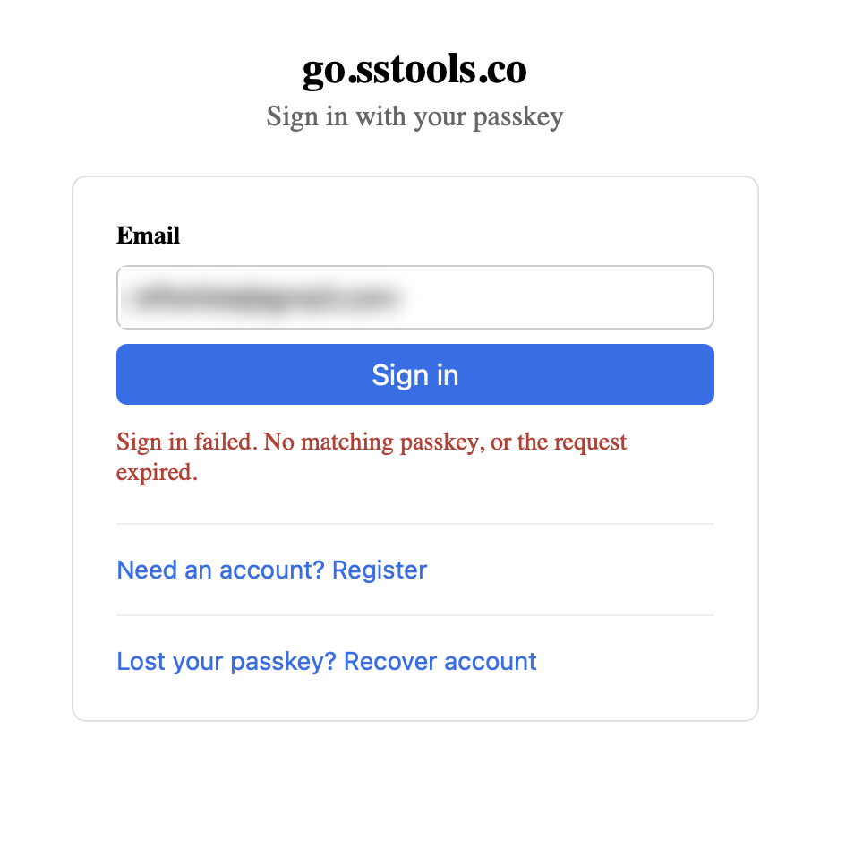

# 0047 — Passkey sign-in fails with "No matching passkey, or the request expired" despite a stored passkey

| | |
|---|---|
| **Status** | closed |
| **Module** | auth |
| **Platform** | macOS |
| **First seen** | 2026-06-17 |
| **Closed** | 2026-06-18 |
| **Branch** | issue/0047 |

## Description

Signing in at https://go.sstools.co/ with `admin@example.com` fails with "Sign in failed. No matching passkey, or the request expired." even though the passkey for the account is present in the macOS Passwords app. The frontend maps **any** 401 from `/auth/login/finish` to this single string (`web/src/views/Login.svelte:98`), so the message reveals nothing about the actual cause — `FinishLogin` deliberately returns a generic `ErrLoginFailed` to the client and logs the real reason server-side via `s.log.Warn("login: …")`. This issue needs the server log captured to pin the exact failing step.

## Resolution notes

> 🟢 Resolved 2026-06-18 — the passkey's Backup Eligible / Backup State flags are now persisted at enrollment and rehydrated at login, so go-webauthn's immutability check passes. Existing rows are backfilled `backup_eligible = TRUE`, unblocking the already-enrolled admin credential. The detailed mechanism is in **Confirmed root cause** and **Fix plan** below.

## Review

Reviewed by claude-opus-4-8, one round. The reviewer verified the fix against go-webauthn v0.17.4 (`ValidateLogin` BE-immutability check at `webauthn/login.go:371`), confirmed BE is written once and never overwritten on login while BS is refreshed from `validated.Flags.BackupState`, audited the `InsertCredential` parameter renumbering and the `UpdateSignCount`/`TouchCredentialLastUsed` rewrites for placeholder correctness, and confirmed `ListCredentialsForUser` (account-settings display) is untouched so flags don't leak through the management API. Verdict: request-changes for a single gofmt nit on the `StoredCredential` struct alignment; all logic approved. The `gofmt -w` fix was applied and re-verified (gofmt-clean, auth tests still pass), satisfying the reviewer's stated approval condition.

## Verification

Orchestrator stood up a local PostgreSQL test DB, applied migrations `000001`–`000009` cleanly, and ran `go test ./...` with `TEST_DATABASE_URL` set. All packages pass — `internal/auth`, `internal/db`, `internal/handlers` — including the two new tests: **`TestLogin_BackupEligibleCredentialSucceeds`** (registers a BackupEligible authenticator, asserts the flags persisted, then drives a real `FinishLogin` to success — this fails before the fix) and **`TestLogin_BackupFlagsRoundTripStoreLoad`** (flags survive store→load via both `CredentialByID` and `CredentialsForUser`). `go build ./...` and `go vet ./...` clean; `gofmt -l internal/auth/` clean. The only failing test in the repo, `internal/config/TestLoad_DefaultsApplied`, is pre-existing on `main` (env-sensitive, needs `BASE_URL`) and unrelated — this branch does not touch `internal/config`.

## Files changed

- `migrations/000009_passkey_backup_flags.up.sql` — adds `backup_eligible`/`backup_state BOOLEAN NOT NULL DEFAULT FALSE`; backfills existing rows `backup_eligible = TRUE` (commented: safe because all enrolled credentials here are Apple synced passkeys).
- `migrations/000009_passkey_backup_flags.down.sql` — drops both columns.
- `internal/auth/store.go` — `StoredCredential` + `CredentialRecord` gain `BackupEligible`/`BackupState`; `InsertCredential` writes them; `CredentialByID` / `CredentialsForUser` / `scanCredentialRecords` select+scan them; `UpdateSignCount` / `TouchCredentialLastUsed` gain a `backupState` param and update `backup_state`.
- `internal/auth/registration.go` / `internal/auth/recovery.go` — populate flags from `credential.Flags.BackupEligible` / `.BackupState`.
- `internal/auth/login.go` — `credentialFromRecord` sets both flags from the record (stale comment removed); `FinishLogin` passes `validated.Flags.BackupState` into the update calls.
- `internal/auth/login_test.go` — new `TestLogin_BackupEligibleCredentialSucceeds` and `TestLogin_BackupFlagsRoundTripStoreLoad`, plus the BE-authenticator + flag-reading test helpers.

## Gotchas

- **The backfill assumes all enrolled credentials are backup-eligible (synced) passkeys.** Correct for this deployment, but on a deployment that enrolled device-bound passkeys (BE=false) the `UPDATE … SET backup_eligible = TRUE` would set the wrong value and re-introduce the inconsistency for those credentials. Documented in the migration.
- **Deploy requires running the migration.** After deploying the new binary, `000009` must be applied to the production DB or login still fails (column missing). See the post-merge deploy note.

## Confirmed root cause (2026-06-18)

Server log captured the exact failing step:

```
WARN login: validating assertion err="Backup Eligible flag inconsistency detected during login validation"
```

go-webauthn's `ValidateLogin` treats the credential's **Backup Eligible (BE)** flag as immutable: the value recorded at registration must equal the value presented on every assertion. An iCloud Keychain / synced (multi-device) passkey — the macOS Passwords app credential — sets **BE = true**.

The storage layer never persists that flag:

- `StoredCredential` (`internal/auth/store.go:296-304`) and the `passkey_credentials` table (`migrations/000004_create_auth_credentials.up.sql:14-25`) have **no backup-eligible / backup-state columns**. Registration (`internal/auth/registration.go:222-229`) and recovery (`internal/auth/recovery.go:225-232`) discard `credential.Flags`.
- At login, `credentialFromRecord` (`internal/auth/login.go:298-308`) rebuilds the credential with `Flags` left at the zero value → **BE = false**. Its comment encodes the wrong assumption ("synced platform passkeys … carry the same (unset) flags here").
- Validation then compares stored **false** against assertion **true** → inconsistency → generic `ErrLoginFailed` → 401 → the "No matching passkey, or the request expired" screen.

Registration appears to succeed because creation compares nothing; the mismatch only surfaces at login. **Net effect: every backup-eligible (Apple/iCloud-synced) passkey can be enrolled but can never authenticate** — a total lockout for the app's primary intended authenticator. This supersedes the "Suspected causes" guesses below (the conditional-UI challenge race and RP-ID theories were both wrong).

## Fix plan

1. **Migration** (`000006_*`): add `backup_eligible BOOLEAN NOT NULL DEFAULT FALSE` and `backup_state BOOLEAN NOT NULL DEFAULT FALSE` to `passkey_credentials`.
2. **Persist flags on enrollment**: add `BackupEligible` / `BackupState` to `StoredCredential`; populate from `credential.Flags.BackupEligible` / `.BackupState` in both `registration.go` and `recovery.go`; write them in `InsertCredential`.
3. **Rehydrate on login**: select the two columns in `CredentialRecord` / `CredentialByID` / `CredentialsForUser` and set `c.Flags.BackupEligible` / `c.Flags.BackupState` in `credentialFromRecord` (delete the stale comment).
4. **Track mutable BS**: BE is immutable (store once); `backup_state` can flip — update it alongside `sign_count` / `last_used_at` on each successful login.
5. **Unblock the already-enrolled credential**: existing rows default to `backup_eligible = false` and would still fail. Either (a) backfill `UPDATE passkey_credentials SET backup_eligible = TRUE` in the migration — safe here because every enrolled credential is an Apple synced passkey — or (b) have the admin re-run the recovery ceremony to enroll a freshly, correctly-stored credential. Prefer (a) so the existing passkey keeps working.
6. **Tests**: add a login test with a backup-eligible credential (stored BE=true, assertion BE=true) that currently would fail, plus a regression guard that the flags round-trip through store → load.

## Long Description

The credential was created via the account-recovery ceremony (`/recover/verify`), not normal registration. Both ceremonies store the credential identically — `credential_id` as raw `BYTEA` (`migrations/000004_create_auth_credentials.up.sql:18`), inserted as raw bytes (`internal/auth/store.go:308-314`) and looked up by raw bytes in `CredentialByID` (`store.go:475-483`) — so a storage/encoding mismatch is unlikely. The failure is therefore one of the discrete steps inside `FinishLogin` (`internal/auth/login.go:137-195`), each of which logs its own warning:

- `login: resolving credential` — the assertion's credential id isn't in `passkey_credentials` (wrong/missing row).
- `login: consuming challenge` — the single-use challenge was expired (5-min TTL, `authenticationTTL`) or already consumed. **Suspect:** the Login view fires a background conditional-UI `loginStart()` on mount *and* a second `loginStart()` when the user clicks "Sign in" (`Login.svelte:136-151` and `:112-133`), so two challenge rows can be outstanding at once.
- `login: validating assertion` — `s.wa.ValidateLogin` rejected the signature: RP ID / origin mismatch (`WEBAUTHN_RP_ID` / `WEBAUTHN_RP_ORIGIN`), user-verification not satisfied, or userHandle mismatch.

Whichever line appears in the log is the answer.

## Steps to reproduce

1. Go to https://go.sstools.co/.
2. Enter `admin@example.com` and click **Sign in**.
3. Select the stored passkey when prompted.
4. Observe "Sign in failed. No matching passkey, or the request expired."

## Expected behavior

A valid assertion from the account's stored passkey authenticates, sets the session cookie, and lands on the dashboard.

## Actual behavior

The finish call returns 401 and the login screen shows "No matching passkey, or the request expired." The passkey is confirmed present in the macOS Passwords app.

## How to get the server logs (run on the EC2 box)

```bash
# The exact failing step — this is the decisive line:
sudo journalctl -u shortlinks --since "30 min ago" | grep -i "login:"

# Wider context around the attempt (request flow, any panics):
sudo journalctl -u shortlinks -n 200 --no-pager

# Confirm the credential row, the account's active flag, and challenge state:
bash scripts/db-status.sh admin@example.com
```

Map the `login:` line to the cause: `resolving credential` → row missing/mismatched; `consuming challenge` → expired/double-issued challenge; `validating assertion` → RP ID/origin/UV/signature. Also check the running unit's env for `WEBAUTHN_RP_ID=go.sstools.co` and `WEBAUTHN_RP_ORIGIN=https://go.sstools.co` (`sudo systemctl show shortlinks -p Environment` / `/etc/shortlinks/config.env`), and that the address bar was exactly `https://go.sstools.co` (RP ID is origin-bound).

## Suspected causes (ranked, pending the log)

1. **Stale/double-issued challenge** — the conditional-UI ceremony and the button ceremony each call `loginStart`, leaving two challenge rows; a slow OS prompt can push the consumed one past the 5-min TTL → `login: consuming challenge`.
2. **RP ID / origin mismatch** — env misconfig or the passkey was created on a different origin than the login origin → `login: validating assertion`.
3. **Credential not actually persisted by recovery** — `db-status.sh` shows no `passkey_credentials` row → `login: resolving credential`.

## Attachments



## Relation

- Related: [#0046](0046.md) (recovery landing URL not cleared — separate dead-end on reload)
- Related: [#0044](0044.md) (recovery-based first-admin bootstrap — how this passkey was created)

## Work log

| Date | Model | Input | Output | Cache read | Cache write | Cost |
|---|---|---|---|---|---|---|
| 2026-06-18 | claude-sonnet-4-6 | 427 | 13,242 | 2,725,296 | 62,717 | $1.25 |
| 2026-06-18 | claude-opus-4-8 | 6,238 | 3,085 | 209,620 | 37,380 | $0.45 |

**Total: $1.70**
