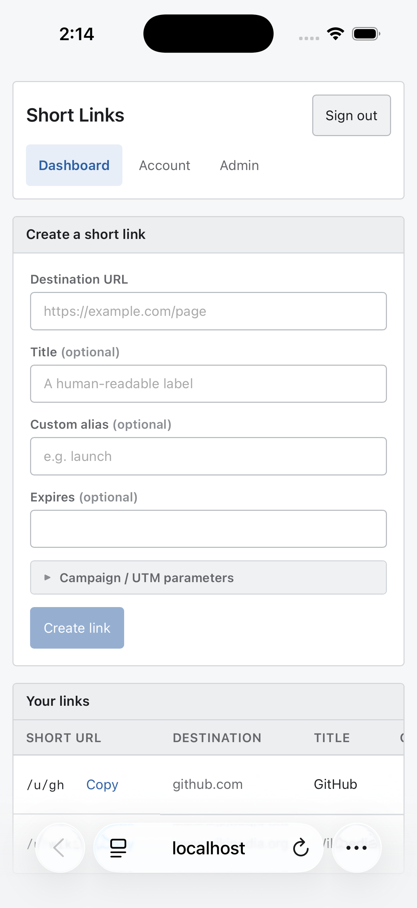

# 0060 — iPhone Simulator (iOS Safari) verification workflow for layout & JS

| | |
|---|---|
| **Status** | resolved |
| **Module** | web / infra |
| **Platform** | iOS / macOS |
| **First seen** | 2026-06-22 |
| **Closed** | 2026-06-24 |
| **Commit** | 5bfd550 |

## Description

Establish a workflow to load the locally-running site (#0059) in the **iOS Simulator's Safari** to verify responsive layout, native-control rendering (e.g. the `datetime-local` Expires field from #0053), and JS behavior on real mobile Safari — and capture screenshots for review.

## Motivation

The #0053 saga (Expires field width, then height) happened because iOS-Safari-specific rendering cannot be verified in a headless/desktop environment. The iOS Simulator runs genuine mobile Safari, so it can verify exactly this class of issue locally instead of via repeated production deploys. (Part of [#0056](0056.md).)

## Proposed approach

- Document (and optionally script) the Simulator loop using Xcode's `simctl`: boot a device (`xcrun simctl boot "iPhone 15"`), open the dev URL in its Safari (`xcrun simctl openurl booted http://localhost:8080`), and screenshot (`xcrun simctl io booted screenshot out.png`). The simulator reaches the Mac's `localhost`.
- Note prerequisites (Xcode + an iOS runtime installed) and that this is for layout/JS verification, not automated E2E.
- Optionally add a small `scripts/` helper or a project skill to boot → open → screenshot in one step.
- First use: confirm #0053 renders correctly (Expires field width **and** height match the other inputs) in the simulator.

## Acceptance criteria

- [x] Documented steps (and/or a script) to boot the iOS Simulator, open the local site, and capture a screenshot
- [x] Confirmed the Expires field (#0053) renders at the correct width and height in the simulator's Safari
- [x] Prerequisites (Xcode / iOS runtime) noted; no production impact

## Relation

- Umbrella: [#0056](0056.md). Depends on [#0059](0059.md) (needs the app running locally). Validates [#0053](0053.md), [#0050](0050.md), [#0051](0051.md).

## Implementation

Added `scripts/sim.sh [URL] [device] [out.png]` (defaults `http://localhost:8080`, `iPhone 17`, `/tmp/shortlinks-sim.png`): resolves the device UDID (`simctl list -j`, prefers an already-booted one), boots it if needed (guarded so an already-booted sim doesn't trip `set -e`), opens the URL in its Safari (`simctl openurl`), and captures a screenshot (`simctl io … screenshot`). Documented in `docs/dev.md` ("Verifying mobile rendering (iOS Simulator)"). Built on `issue/0060` (Sonnet implement, Opus review → APPROVE), squash-merged to `main` as `5bfd550`.

## Verification

End-to-end, for real: built the SPA, ran the dev server (`STORAGE=json`, no Postgres) on `:8080`, ran `scripts/sim.sh`, booted an iPhone 17 (iOS 26.5), loaded the app, and captured `issues/0060/dashboard.png` — which shows the ShortLinks dashboard rendered in mobile Safari, auto-logged-in as the mock admin (#0058), with the seeded `/u/gh` link and the full create form including the **Expires field, which renders at the same width/height as the other inputs** (the #0053 fix confirmed in a real iOS Safari for the first time). `bash -n scripts/sim.sh` clean; dev-tooling only — no production code touched.

## Attachments

## Files changed

- `scripts/sim.sh` — NEW (executable): boot sim → open URL → screenshot.
- `docs/dev.md` — "Verifying mobile rendering (iOS Simulator)" section.
- `issues/0060/dashboard.png` — verification screenshot.

## Gotchas

- First sim boot is slow (~30–60s); reuse a booted sim afterward. Run the app (`./scripts/dev.sh --built`) before `sim.sh` so the page is ready when the screenshot fires.
- When two iOS runtimes both have an "iPhone 17", the script takes the first match.

## Work log

| Date | Model | Input | Output | Cache read | Cache write | Cost |
|---|---|---|---|---|---|---|
| 2026-06-24 | claude-sonnet-4-6 | 34 | 6,159 | 779,070 | 30,866 | $0.44 |
| 2026-06-24 | claude-opus-4-8 | 3,625 | 2,523 | 58,675 | 19,574 | $0.23 |

**Total: $0.67**
