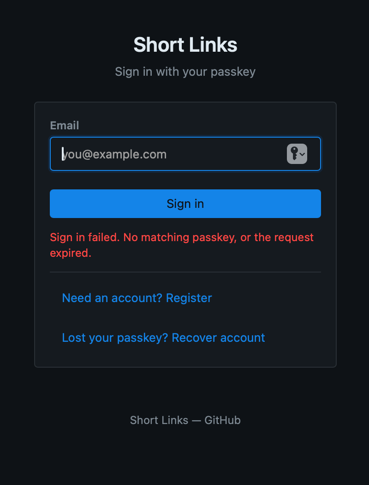
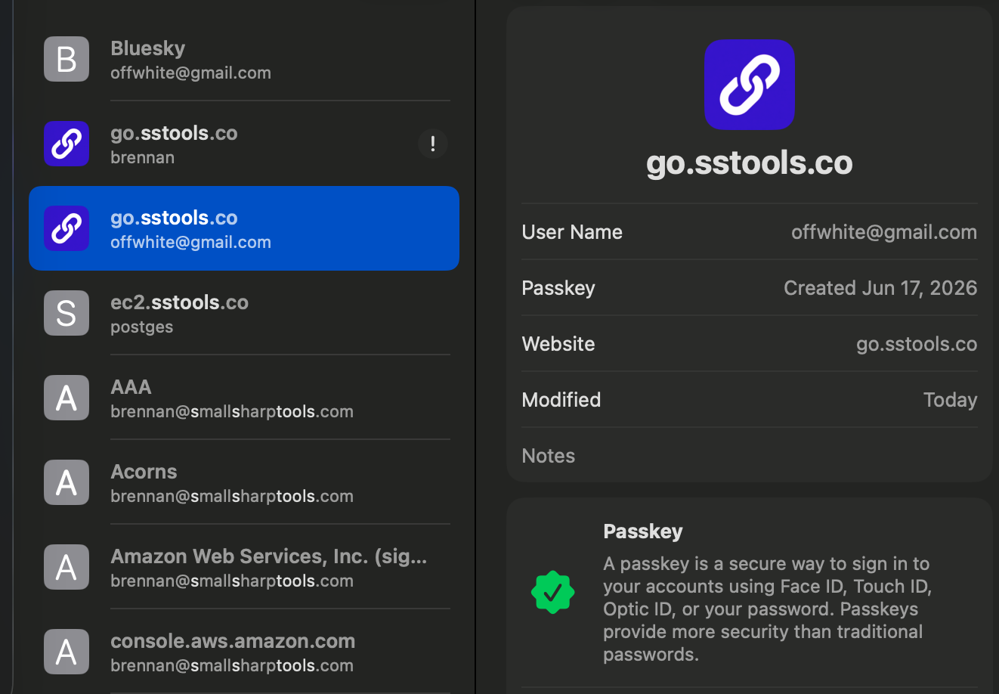

# 0092 — Login requests userVerification "preferred" but validates as "required", locking out clients that return UV=false

| | |
|---|---|
| **Status** | open |
| **Module** | auth |
| **Platform** | All |
| **First seen** | 2026-07-30 |

## Description

The login ceremony asks the browser for `userVerification: "preferred"` but then enforces `VerificationRequired` when validating the assertion. Any client that legitimately returns **UV = false** — which "preferred" explicitly permits — is rejected with a generic 401 and can never sign in. This was hit in the real world signing in to `go.sstools.co` from **Safari over Screen Sharing**, where Touch ID is unreachable because there is no physical presence at the sensor.

The asymmetry:

- **Registration and recovery** request UV correctly. `registrationOptions()` (`internal/auth/webauthn.go:137-144`) passes `UserVerification: protocol.VerificationRequired` via `webauthn.WithAuthenticatorSelection`.
- **Login does not.** `StartLogin` calls `s.wa.BeginLogin(loginUser)` and `s.wa.BeginDiscoverableLogin()` with **no options** (`internal/auth/login.go:77,82`). The assertion options therefore inherit `webauthn.Config.AuthenticatorSelection.UserVerification` (`go-webauthn webauthn/login.go:87`), and `NewWebAuthn` (`internal/auth/webauthn.go:26-35`) never sets `AuthenticatorSelection`. It is the empty string, so the browser applies the WebAuthn spec default of **`"preferred"`**.
- **`FinishLogin` hardcodes `UserVerification: protocol.VerificationRequired`** in the session it hands to `ValidateLogin` (`internal/auth/login.go:187`), which becomes `shouldVerifyUser = true` (`go-webauthn webauthn/login.go:354`) and is enforced at `protocol/authenticator.go:418`.

Asked for "preferred", enforced as "required".

## Why the macOS behavior differs by machine

The macOS password fallback is not offered on the OS's own initiative — it is triggered by the relying party requesting `userVerification: "required"`. When a site asks for `required` and Touch ID is unreachable, macOS prompts for the Mac login password and the assertion carries **UV = true**. (Confirmed empirically: signing in to the AWS Console over the same Screen Sharing session prompted for the Mac password and succeeded.) When a site asks for `"preferred"` and Touch ID is unreachable, macOS may skip local verification entirely — no prompt, no password, **UV = false**.

So the bug is invisible on a Mac you are physically sitting at (Touch ID fires unprompted, UV = true) and fatal over Screen Sharing.

## Diagnosis trail

Production log for the failing attempts:

```
Jul 30 21:10:23 bluesky.sstools.co shortlinks[3638912]: WARN login: validating assertion err="Error validating the authenticator response"
```

`(*protocol.Error).Error()` returns only the `Details` field (`protocol/errors.go:18-20`). In go-webauthn v0.17.4 exactly three code paths return `ErrVerification` with that default `Details` string — every other failure calls `.WithDetails(...)` and would have printed something else. All three are in `AuthenticatorData.Verify`:

| Site | Check | Ruled out? |
|---|---|---|
| `protocol/authenticator.go:405` | RP ID hash mismatch | Yes — `CollectedClientData.Verify` runs first (`protocol/assertion.go:155`) and passed, so origin and challenge were both correct, which means the RP ID hash matched. |
| `protocol/authenticator.go:411` | User Present flag not set | Yes — Apple platform authenticators always set UP. |
| `protocol/authenticator.go:418` | **User Verified flag not set** | **This one.** |

`scripts/db-status.sh offwhite@gmail.com` confirmed the account is active, the single `passkey_credentials` row exists (created 2026-06-18, last used 2026-07-19), and no challenge or credential-resolution step failed. The passkey, iCloud sync, and the stored credential are all fine.

## Steps to reproduce

1. Connect to a Mac via Screen Sharing (or use any authenticator that returns UV=false under a "preferred" request).
2. Open `https://go.sstools.co/` in Safari on that Mac.
3. Click **Sign in** and select the synced passkey.
4. Observe: no password prompt appears, and sign-in fails.

## Expected behavior

The login ceremony requests `userVerification: "required"`, matching what `FinishLogin` enforces. Safari then performs user verification — Touch ID when available, falling back to the Mac login password when it is not — and the assertion validates.

## Actual behavior

No verification prompt appears, the assertion returns UV = false, `ValidateLogin` rejects it, and the client shows "Sign in failed. No matching passkey, or the request expired."

## Scope / deliverables

- Set `AuthenticatorSelection: protocol.AuthenticatorSelection{UserVerification: protocol.VerificationRequired}` on the `webauthn.Config` in `NewWebAuthn` (`internal/auth/webauthn.go`) so **both** login paths inherit it. Registration already passes the same value explicitly via `registrationOptions()`, so enrollment behavior is unchanged.
- Tests asserting the emitted assertion options carry `userVerification: "required"` for **both** the allowCredentials path (`BeginLogin`, email resolves to an account with credentials) and the discoverable path (`BeginDiscoverableLogin`, no/unknown email).
- A handler-level test asserting the JSON from `GET /auth/login/start` contains `"userVerification":"required"`.

## Acceptance criteria

- [ ] `GET /auth/login/start` (with and without `?email=`) returns options containing `"userVerification":"required"`.
- [ ] Registration options are unchanged — still `required`, still `residentKey: required`.
- [ ] `go build ./...`, `go vet ./...`, `gofmt -l internal/auth/` clean.
- [ ] `go test ./...` passes, including the new tests, and the new test names are observed in the run output.

## Out of scope

- Relaxing `FinishLogin` to accept UV=false. UV must stay required — this is a passkey-only admin app with no second factor. The fix is to *ask* for what is already enforced, not to lower enforcement.
- The `DevInfo` logging gap that made this hard to diagnose — filed separately as [#0093](0093.md).

## Attachments





## Notes

- The second `go.sstools.co / brennan` entry visible in the Passwords screenshot is a stale saved *password* item (passkeys do not get security recommendations, which is what the `!` badge is). This app has no password auth; the entry is unrelated to this bug but is worth deleting since it can make Safari offer the wrong item in the email field's autofill.
- Alternative fix considered: pass `webauthn.WithUserVerification(protocol.VerificationRequired)` at the two `Begin*Login` call sites in `login.go`. Same effect, but it leaves the RP-level default unset, so a third login path added later would silently reinherit `"preferred"`. Setting it on the `Config` is the safer default.

## Relation

- Related: [#0093](0093.md) (login assertion warning discards `DevInfo`, which is why this took elimination rather than one log line)
- Related: [#0047](0047.md) (previous passkey login failure — Backup Eligible flag; same generic client message, different root cause)
