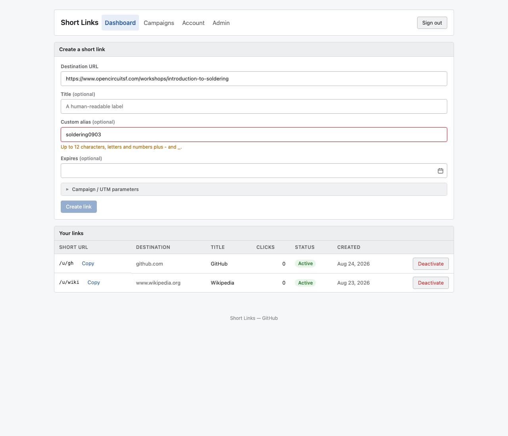

# 0118 — Every 400 on link create is reported as "Enter a valid absolute http(s) URL" on the wrong field

| | |
|---|---|
| **Status** | resolved |
| **Module** | web |
| **Platform** | All |
| **First seen** | 2026-08-25 |
| **Closed** | 2026-08-25 |
| **Commit** | `140930d` |

## Description

`noticeForError` (`web/src/lib/links.ts:155-162`) maps **any** HTTP 400 from `POST /api/links` to the destination-URL field with a fixed string:

```ts
if (err.status === 400) {
  return { kind: 'error', field: 'destination_url', message: 'Enter a valid absolute http(s) URL.' };
}
```

The server's actual message is already available on `ApiError` (`api.ts:83` sets it from the body's `error` field) and is discarded. Four unrelated failures collapse into one wrong sentence pointed at one wrong field:

| Server 400 | Source | Reported as |
|---|---|---|
| `invalid request body` | `links.go:318` | bad destination URL |
| `destination_url must be a valid absolute http(s) URL` | `links.go:323` | bad destination URL ✓ |
| `campaigns are not available` | `links.go:338` | bad destination URL |
| `custom key must be 1-12 url-safe characters` | `links.go:453` | bad destination URL |

Reported from real use: creating a link to `https://www.opencircuitsf.com/workshops/introduction-to-soldering` with the custom alias `soldering-0903` (14 chars), then `soldering0903` (13 chars), failed both times with "Enter a valid absolute http(s) URL." The URL was never the problem — the alias exceeded the 12-character cap (`validKey`, `links.go:1042`, matching `links.key VARCHAR(12)`). Nothing on screen pointed at the alias field, and the destination field was highlighted as invalid.

## Why this matters

**The error message actively misdirects.** A user told their URL is invalid will edit the URL — the one part of the form that was correct — and keep failing. This is worse than a generic "Could not create the link", because a generic message at least prompts you to re-check everything.

The alias cap compounds it: the destination field pre-validates as you type (`isValidHttpUrl`, surfaced at `Dashboard.svelte:387`), so a user reasonably reads "the URL field validates live and it's happy" and then gets told the URL is invalid on submit. The alias field has no client-side validation at all, so its one real constraint is invisible until a round trip fails — and then it's attributed elsewhere.

## Steps to reproduce

1. Sign in and open the dashboard.
2. Enter a valid destination URL, e.g. `https://www.opencircuitsf.com/workshops/introduction-to-soldering`.
3. Enter the custom alias `soldering0903` (13 characters).
4. Submit.

## Expected behavior

An inline error on the **custom alias** field reading what is actually wrong — that the alias must be 1-12 url-safe characters — ideally before the round trip, since the rule is known client-side.

## Actual behavior

An inline error on the **destination URL** field reading "Enter a valid absolute http(s) URL." The alias field is unmarked.

## Scope / deliverables

- `noticeForError` must use the server's message rather than a hard-coded one, and must route the notice to the field the message is about (`key` for the custom-alias rejection, `destination_url` for the URL rejection, no field for the rest).
- Add client-side alias validation mirroring `validKey` (1-12 chars, `[A-Za-z0-9_-]`), surfaced the same way the destination field's `isValidHttpUrl` gate already is, so the common case never needs a round trip.
- Keep the 409 (`key already taken`) and 422 (`url_denied`) branches behaving as they do now.

## Acceptance criteria

- [x] A 400 carrying `custom key must be 1-12 url-safe characters` produces `field: 'key'` with the server's message.
- [x] A 400 carrying the destination-URL message produces `field: 'destination_url'` with that message.
- [x] Any other 400 (`invalid request body`, `campaigns are not available`) produces a banner notice, not an inline field error, and shows the server's text.
- [x] Submitting is blocked, with an inline hint on the alias field, when the alias is over 12 characters or contains a character outside `[A-Za-z0-9_-]`.
- [x] `links.test.ts` covers each of the four 400 shapes.
- [x] `cd web && npm run build` and `npm test` green.

## Out of scope

- Changing the 12-character cap or the `links.key VARCHAR(12)` column.
- Restructuring the server's error envelope into machine-readable codes. Matching on the message string is enough here; a code-based envelope is a larger API change worth its own issue.
- The same `noticeForError` shape used by the campaign batch-create path, unless it falls out for free.

## Notes

- `ApiError` already carries both `message` and the parsed `body`, so no API-layer change is needed.
- The alias is accepted by the server under three JSON names (`key`, `custom_key`, `alias`; `links.go:253-262`) but the SPA only ever sends `key`.

## Relation

- Diagnosing this surfaced [#0117](0117.md) (hard-coded short-link base), which is otherwise unrelated.

## Root cause

Two independent gaps that compounded into a message pointing at the wrong
field.

The 400 branch of `noticeForError` was written when `POST /api/links` had only
one 400 to report — a bad destination URL — and it hard-coded both the field
and the sentence. Three more 400s were added to `Create` afterwards (invalid
body, campaigns unavailable, and the custom-key rejection), and none of them
prompted a revisit of the branch that reports them. The server's actual message
was on `ApiError.message` the whole time and was simply never read.

Separately, the alias input had no client-side gate, while the destination URL
next to it has had one since #0033. So the field with an invisible constraint
was the one whose failure got attributed to the field with a visible one — the
user watched the URL validate live, then was told the URL was invalid.

## Fix

The 400 branch now takes the server's own message and routes it by content:
`custom key` → the alias field, `destination_url` → the URL field, anything
else → a banner with no field blamed. Matching on message text rather than a
machine-readable code was deliberate — the API's envelope is `{error: "<prose>"}`
throughout, and introducing codes for one endpoint would be a wider API change;
the match is on a distinctive substring, and an unrecognized 400 degrades to a
banner carrying the server's exact words. A 400 with no message body is
genuinely unattributable, so it gets a banner naming both inputs rather than a
guess.

`isValidKey` / `MAX_KEY_LENGTH` were added to `lib/links.ts`, mirroring the
server's `validKey` (1-12 characters of `[A-Za-z0-9_-]`, empty meaning
"generate one"). The create form gates submission on it and shows the same
style of inline hint the URL field uses, so the reported case never reaches the
server.

## Verification

- `cd web && npx tsc --noEmit` clean; `npm test` — 383 passed (10 files),
  including five new `noticeForError` cases (one per server 400 shape plus the
  bodyless fallback) and a new `isValidKey` block that pins the two aliases from
  the report, `soldering-0903` and `soldering0903`.
- Confirmed the live server messages against a running instance:
  `POST /api/links` with `key=soldering0903` returns
  `{"error":"custom key must be 1-12 url-safe characters"}`, and with a bad URL
  returns `{"error":"destination_url must be a valid absolute http(s) URL"}` —
  the exact strings the new mapping keys on.
- **Ran the app** (`./scripts/dev.sh`) and reproduced the report in a browser:
  with the destination URL from the report and the alias `soldering0903`, the
  alias field is outlined and captioned "Up to 12 characters, letters and
  numbers plus - and _.", and "Create link" is disabled. Shortening the alias to
  `solder0903` re-enables it and the link creates. See the attachment.

## Files changed

- `web/src/lib/links.ts` — 400 branch reads the server message and routes it via
  a new `fieldFor400`; `serverMessage` suppresses the useless `HTTP 400`
  fallback; new `isValidKey` / `MAX_KEY_LENGTH`.
- `web/src/views/Dashboard.svelte` — `keyInvalid` gate on the alias input,
  inline hint, and submission blocked while it is invalid.
- `web/src/lib/links.test.ts` — coverage for all four 400 shapes, the bodyless
  400, and `isValidKey`.

## Gotchas

- The alias is accepted by the server under three JSON names (`key`,
  `custom_key`, `alias`), but only `key` is ever sent by this SPA — worth
  knowing before assuming the field name in a message maps to a form field.
- `noticeForError`'s 409 branch still supplies its own wording rather than the
  server's ("That custom alias is already taken — choose another." vs "key
  already taken"), which is intentional: that message is user-facing advice, not
  a validation rule restated.
- Because the client gate now blocks the reported case before it is sent, the
  server-message routing for the alias 400 is only reachable from another client
  — it is covered by unit tests rather than by the browser walkthrough.

## Attachments


